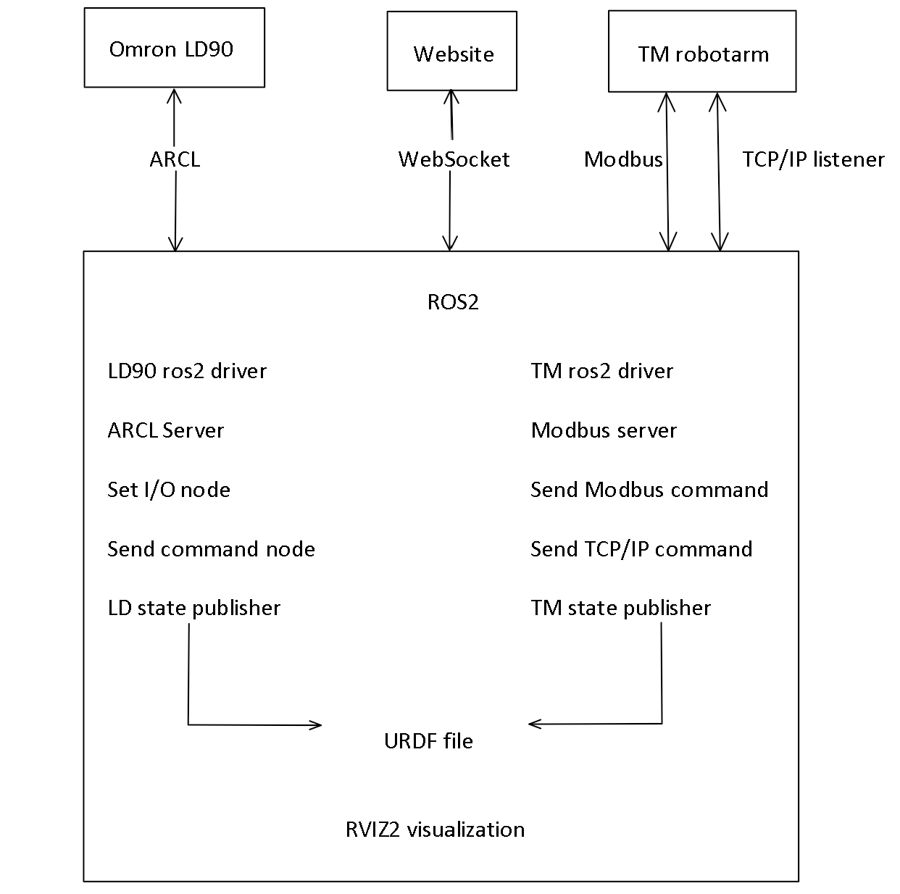

# ROS2 WS
In deze map staat alle code van ROS2 voor de LD90 en TM5-900. Hieronder is een globaal overzicht te zien van de aspecten binnen ros2:


# Build
Als eerst moet er gecontroleerd worden of alle dependencies zijn geïnstalleerd die ROS2 nodig heeft voor de te builden package.
Dit kan gedaan worden door de volgende command line uit te voeren in de ros2_ws directory
```
rosdep update && rosdep install --from-paths src --ignore-src -r -y
```

Gebruik het volgende in de terminal om recourses te beperken bij het build process:

```
export MAKEFLAGS="-j2 -l5"
```

Ga vervolgens naar de ros2_ws map en doe:
```
colcon build
```

Dit kan eventueel ook op de volgende manier als je wil dat je bij het aanpassen van de code hij dit ook meteen meeneemt.
Let op dat als je bestandsnamen veranderd of nieuwe bestanden toevoegt dit niet werkt.
```
colcon build --symlink-install
```

# 1. Mappen structuur
Bij het clonen van de ze reposetory is er de volgende mappen structuur:
``` bash
MobileManipulator_ros2
├── images
│   ├── picture_1.jpg
│   ├── picture_2.jpg
│   └── │ │ 
├── ros2_ws
│   ├── src
│       ├── LD-90
│       ├── moma
│       ├── omron_moma
│       └── TM5
└── README.md
```
Zodra de build is uitgevoerd ziet het er als volgt uit:
``` bash
MobileManipulator_ros2
├── images
│   ├── picture_1.jpg
│   ├── picture_2.jpg
│   └── │ │ 
├── ros2_ws
│   ├── src
│   │   ├── LD-90
│   │   ├── moma
│   │   ├── omron_moma
│   │   └── TM5
│   ├── build
│   ├── log
│   └── install
└── README.md
```
De build, log en install folders worden door colcon gemaakt. Om vervolgens de code te kunnen gebruiken moet je de install folder toevoegen aan je .bashrc bestand. Hierdoor wordt bij het opstarten van een nieuwe terminal of door de huidige te sourcen (source ~/.bashrc) de packages geladen en kan je deze dus ook uitvoeren met ros2 run en ros2 launch.


# 2. Ros2 packages uitgelegd

## 2.1 LD-90
In de LD-90 package zitten 4 sub packages. Dit zijn amr_visualization, om_aiv_msg, om_aiv_navigation en om_aiv_util. Deze zijn grotendeels van [hier](https://github.com/OmronAPAC/Omron_AMR_ROS2/tree/master) overgenomen. Er zijn wel een aantal aanpassingen gedaan om het met ros2 humble te laten samenwerken.

### 2.1.1 amr_visualization
De amr_visualization package wordt gebruikt voor de RVIZ visualisatie van ros2. In deze package zit de ingescande map en de 3D modellen van de robot. Het 3D model wordt in de visualisatie geplaatst volgens het .urdf bestand. Ook zit er in deze package 4 C++ bestanden die data verwerken voor de visualisatie van de robot. Dit zijn data_points_marker.cpp, goals_marker.cpp, joints_publisher.cpp en laser_scans.cpp. 

De data_points_marker leest het data.map bestand dat van de LD90 is gehaald na het inscannen van de map. Het programma converteert deze data.map naar een formaat dat RVIZ het kan visualiseren. Het haalt ook de verboden gebieden op uit de map en visualiseert deze ook in RVIZ. 

De goals_marker ontvangt de goals van de LD90 en converteert dit naar een formaat zodat deze op de map van RVIZ is te zien.

De joints_publisher zorgt ervoor dat de joints van de robot in RVIZ worden gevisualiseerd. Dit zorgt er daardoor voor dat het 3D model van de robot op de juiste positie op de map staat en in real time mee beweegt met de fysieke robot.

De laser_scans zorgt ervoor dat de laserscan van de robot in RVIZ wordt gevisualiseerd. Dit zijn de lasers die voor de navigatie worden gebruikt door de LD90. Nu is alleen de hoofdlaser aan de voorkant te zien maar de andere 3 lasers (2 zei lasers en 1 lage laser voor) zijn ook mogelijk om hier aan toe te voegen.

De package kan worden uitgevoerd door de volgende command line uit te voeren:

```
ros2 launch amr_visualization display.launch.py
```

### 2.1.2 om_aiv_msg
De packages van de LD90 maken gebruik van custom messages. Deze messages worden gemaakt door de om_aiv_msg package. Deze package bevat de messages die nodig zijn voor de communicatie tussen de verschillende nodes die draaien. In deze custom message bestanden staat gedefinieerd welke variabelen er in de message zitten, van welk type deze zijn (int, uint, string, float, etc..) en of er ook een gedefinieerd response moet zijn. dit laatste is alleen bij services en niet bij topics.

### 2.1.3 om_aiv_navigation
De om_aiv_navigation package is een library package. Hierin zitten verschillende functies die door de andere packages worden opgeroepen. Dit is bijvoorbeeld het sturen naar een goal die op de LD90 is ingesteld, het sturen naar het docking station en nog een andere paar.

### 2.1.4 om_aiv_util
De om_aiv_util package kan worden gezien als de server package. Deze moet worden gestart om überhaupt iets te kunnen aansturen. Hier zit namelijk de ARCL server in welke commando's stuurt en data ontvangt van en naar de LD90. Hier is ook het IP adres van de LD90 in ingesteld en mocht er iets moeten worden uitgebreid aan commando's kan dat worden gedaan in deze package. Ook zit hier de LD state publisher in, deze ontvangt alle data zoals positie van de LD90 en vertaald dit naar iets dat ros2 kan gebruiken in bijvoorbeeld RVIZ2.

Deze package kan op de volgende manier worden gestart:
```
ros2 launch om_aiv_util server.launch.py
```

## 2.2 moma
Deze package is bedoeld voor de website. Hier zit de package topics_services in met daarin de order en telemetric message die worden gebruikt door de website. De order message wordt gesubscribed door het moma_coffee.py programma (zie omron_moma package) en op gepublished door de website. De telemetric wordt gesubscribed door de website en gepublished door moma_coffee.py

## 2.3 TM5


### 2.3.1 Robotiq gripper
Omdat de robotiq gripper niet op de IO is aangesloten maar op de COM1 poort van de TM5 was het niet mogelijk om deze met modbus of TCP/IP aan te sturen zonder deze uit de listener node te halen. Daarom is er voor gekozen om een usb naar RS232 converter te gebruiken en deze op de NVIDIA Jetson aan te sluiten. Dit betekende wel dat de IO driver een stukje moest worden herschreven. In de IO driver is nu een publisher toegevoegd welke op de gripper_cmd topic published. Deze topic is vervolgens weer verbonden met een ros2 robotiq driver. Deze driver is standaard ingesteld op ttyUSB0 met een baudrate van 115200, dit zijn de standaard instellingen en zouden altijd moeten werken (tenzij je natuurlijk een ander ttyUSB apparaat toevoegd). 

### 2.3.2 Modbus
De robotarm is ingesteld als ethernet slave maar ook Modbus TCP is geactiveerd. Dit zorgt er voor dat de robotarm positie en andere gegevens kunnen worden uitgelezen zonder dat het programma draait. Dit is erg handig omdat je dus de robotarm in free mode kan bewegen en ondertussen live de positie kan uitlezen. Dit wordt bijvoorbeeld gebruikt in het inleer programma van de demo. Er is een modbus.py programma welke de commando's stuurt en ontvangt. Deze zou makkelijk kunnen worden aangepast. De registers met informatie is online te vinden of in de Modbus instellingen van de roborarm. Via modbus kan onder andere het voltage, vermogen, temperatuur, programma informatie, etc worden uitgelezen. Ook kanb de IO worden aangestuurd en zelfs de controller met de play/pause knop kan je bedienen, je kan dus met modbus het programma automatisch laten starten.

### 2.3.3 TCP/IP listener node


### 2.3.4 TM state publisher
De TM state publisher geeft de hoeken van de robotarm links door. Dit wordt vervolgens gevisualiseerd in RVIZ2. Dit komt door het URDF bestand waar de links in zijn gedefinieerd. Voor meer informatie hieropver zie 2.4.3 Robot description

## 2.4 omron_moma
In deze package worden de vorige packages samengevoegd tot een geheel. Hier zitten ook de demo en inleer programma's in.

### 2.4.1 launch
Als je de volledige moma wil opstarten hoef je niet de de LD90 of TM5 ros2 drivers op te starten. Deze worden hierin allemaal al gedaan. Hier zitten 2 verschillende launch bestanden in met elke ook een headless versie (deze start op de achtergrond op). Als eerst moet op de NVIDIA Jetson de server worden opgestart. Dit gaat op de volgende manier:
```
ros2 launch omron_moma server.launch.py robot_ip:=192.168.44.14
```
Dit start de LD90, TM5, robotiq gripper en rosbridge server (voor de website) op. Zodra dit is opgestart kan je alles doen wat je wil met de moma qua aansturen. Let er alleen wel op dat de TF2 functies nu niet zijn opgestart. Deze geeft de referentie punten om met bijvoorbeeld de camera iets op te pakken met een TM-marker. Om dit te kunnen doen moet ook de visualisatie worden opgestart. Dit hoeft niet perse op de NVIDA Jetson maar moet wel op hetzelfde netwerk als deze zitten en dit netwerk moet openstaan voor ros2 commando's (dit is niet bij elk netwerk, wel binnen het smartindustry netwerk). Dit kan op de volgende manier worden opgestart:
```
ros2 launch omron_moma visualization.launch.py
```
Dit start de verschillende state publisher en visualization nodes op. Ook laad dit de robot description met RVIZ2 (zie 2.4.3 robot description)

### 2.4.2 omron moma
In deze package zitten alle demo en inleer programma's. Deze kunnen makkelijk worden hergebruikt/aangepast worden voor toekomstige projecten. Er is echter geen voorbeeld met MoveIt2 kunnen maken wegens tijdgebrek (dit is voor complexere applicaties voor de minor ASE). De demo.py en teach_demo.py horen bij elkaar en de moma_coffee.py en teach_moma_coffee.py horen bij elkaar. De eerste is elke keer het inleer programma en de tweede is om het ingeleerde programma uit te voeren. Deze kunnen op de volgende manier gestart worden:
```
ros2 run omron_moma <programma naam>
```
Let er wel op dat bij het inleer programma het ip-adres mee moet worden gegeven als argument. Hieronder een voorbeeld hiervan:
```
ros2 run omron_moma teach_moma_coffee 192.168.44.14
```


### 2.4.3 Robot description
De robot is omschreven met een URDF bestand. Deze kan RVIZ2 vervolgens uitlezen en gebruiken voor de visualisatie. Ook wordt de URDF gebruikt voor de TF2 markers. Waar dit bijvoorbeeld wordt gebruikt is bij de TM robot marker. Deze word door de camera van de robot gezien en geeft vervolgens door op welke coordinaten deze zit. Dit wordt vervolgens als TF2 gepublished en wordt vanaf dat punt gekeken naar de ingeleerde coordinaten vanaf de marker. Deze coordinaten worden vervolgens naar de robotarm gestuurd en deze zal het object dan oppakken. De urdf wordt ook geupdate door de verschilende state publishers deze zeggen bijvoorbeeld dat de LD90 op de coordinaten 100,200 is. De RVIZ2 visualisatie update dan het 3D model naar die plek. Aan de LD90 zit ook het chassis en robotarm verbonden door de URDF dus deze zullen dan ook meebewegen in RVIZ2.

# 3. Demo programma

